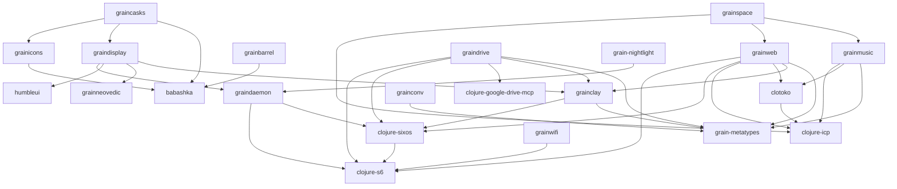

# Dependency Graph

**Generated from grainstore.edn** - Do not edit manually!

## Legend

- **Solid arrows**: Direct dependencies
- **Module names**: Click to see module details

---

*Generated on 2025-10-22T17:21:58.059423686*
